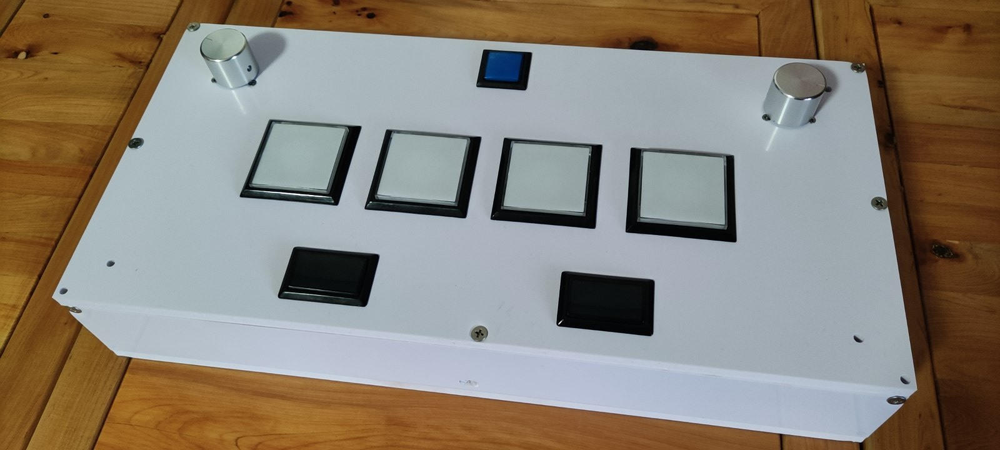
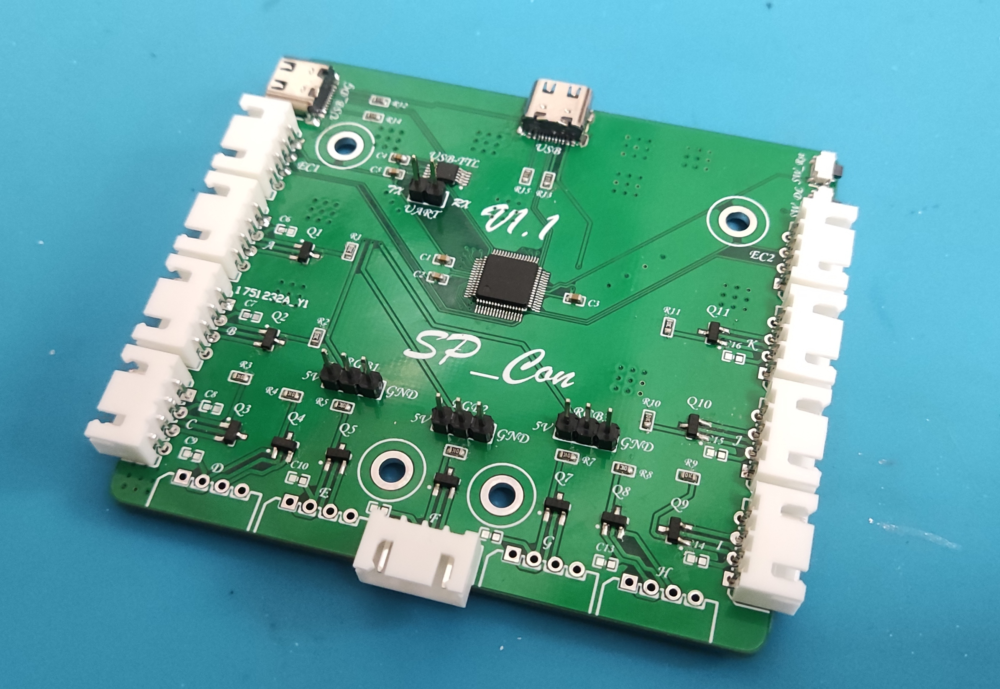

# SDVX-SP_Con
An Arcade PC Controller for SDVX. At the same time, the scheme is compatible with O.N.G.E.K.I Controller and IIDX Controller.

一个SDVX手台 同时方案兼容音击和IIDX。

# 需要的准备

### 手台核心部件

- SDVX按键一套，包括：
  - 4x  BT（大-白色正方形按钮）
  - 2x  FX（黑色长方形按钮）
  - 1x  START键
  注：购买按键的时候需要**保证按键加上微动的长度不超过60mm**，因为外壳内部空间的高度就是65mm，星韵按键正好可以塞进去
- 7x  按键对应微动
- 5x(最少，越多越好)  5V蓝色按键配件LED
- 2x(最少，越多越好)  5V红色按键配件LED
- 2x  编码器（单片机5V专用，正交型，即AB相输出）

### 外壳&安装

- 1x  PVC 外壳（由6块面板构成，使用CADFiles文件夹下的CAD文件制作，推荐一家叫“多美歌广告的淘宝店”）
- 20x(最少，越多越好)  25mm M5沉头自攻螺丝（用来安装外壳）
- 6x(最少，越多越好)  16mm M5沉头螺丝（普通螺纹，用来安装编码器）
- 4x(最少，越多越好)  3（螺纹直径mm）*7（六角长度 mm）+3（螺纹长度 mm）的铜柱（用来固定PCB）
- 4x(最少，越多越好)  5mm M3螺丝（普通螺纹，用来固定PCB）
- 1x  502粘合剂（用来固定铜柱）
- 1x  M3钻头（用来给铜柱固定位钻孔）

##### 		可选

  - 4x(最少，越多越好)  25mm M5螺丝（普通螺纹，如果想安装UV面板需要）
  - 8x(最少，越多越好)  M5垫片（诺干，同上用来安装UV面板）
  - 4x(最少，越多越好)  M5自锁螺母
  - 4x  脚垫（类似机箱的那种，预留了4个M5的安装孔位）

### Hardware 

- 1x  PCB（能用**Hardware**中的gerber文件制作[gerber_SPCon.zip]，制作方式参考下文**Hardware部分**）

- PCB需要的器件，详情参考表**Hardware/SPCon.pdf**第三页

- 1x  电烙铁

- 7x(最少，越多越好)  4P XH2.54转插簧6.3转接线：

  淘宝上没有卖现成的，有两种准备方法

  1. 可以买压线钳自己压线[笔者做法，耗时费力]，但是编码器那边直接用压线钳压XH2.54头子就很方便；
  2. 找淘宝店定制，只需将4P XH2.54转插簧6.3转接线描述文字发给淘宝电商即可，但是编码器接线需要做其它处理，详见**组装部分/9.**，实物如下图
  
  
  
  
  
  注：PCB上的元器件在Hardware中的SPCon.pdf文件第三章中有详细信息

### Software

- WCHISPTool(用来给MCU下载程序)

# Hardware部分

1. 下载嘉立创PCB下单助手（下载地址https://download.jlc.com/jlchelper/release/3.4.5/JLCPcAssit_setup_3.4.5.zip?pname=quote_order）

2. 将**Hardware**中的gerber_SPCon.zip投至立创PCB下单助手中下单

3. 在立创商城或者淘宝购买焊接需要的相应的物品，MCU使用的是WCH的CH557，其它杂项可以根据**Hardware/SPCon.pdf**的第三页参考购买，串口功能区如果不需要的话可以不用购买响应的物品（CH340，USB_DG等）

4. PCB板焊接，串口功能区如果不需要的话可以不用焊接（CH340，USB_DG等）

   

   注意：PCB上每一个按键接口旁边都有一个电容的焊盘，在清单中是100nF的电容，这些电容本来一开始是想用来做按键的硬件滤波，后来经过示波器测试之后发现**加上滤波电容后按键响应时间从原来的80ns变为了2us，建议和我一样不用焊接。**
   
   
   
   成品如下图
   
   

# Software部分

1. 下载WCHISPTool（下载链接 http://www.wch.cn/downloads/file/196.html?time=2022-02-17%2020:53:09&code=shmzR6M3qjlkc9WQuq9JnszYYzXa14gB9BgJpesf ）

2. **按住PCB板上的按键SW_DL后**，插上USB线，如下图

   

3. 此时WCHISPTool应当会自动检测到芯片CH557（如果没有请检查CH557是否虚焊），程序选择**Software/Objects**下的CH557.hex，如下图

   

4. 点击下载

4. 重新插拔供电线，或者按下SW_Rst后，打开系统设备管理器，观察设备中是否多出来了一个鼠标和键盘

# 组装部分

- 面板的主要固定方式是螺丝固定

- 面板的摆放类似于夹汉堡——顶面板和底面板夹住前后面板和侧面板

  安装孔位示意如下

  

  

  ### **安装过程**

  1. 首先通过螺丝将底面板和后面板固定在一起，注意用底面板2个螺丝孔的一侧固定后面板，不要使用3个螺丝孔的一侧

  2. 将PCB的USB口对准后面板的USB接口开槽，找到PCB上4个螺丝安装位在底面板上的对应的点

  3. 使用M3钻头进行钻孔，注意孔位一定要对准，而且千万不要将PVC板打穿了（如果不小心打穿了，可以使用25mm M3螺丝 + 3*7双通六角铜柱 + M3螺母 + 脚垫的方式固定）

  4. 将502粘合剂倒入刚刚钻好的孔洞之后，并将四个铜柱按入其中

  5. 等待502固化后，安装PCB板

  6. 在顶面板上安装按键，微动

  6. 在顶板面上通过6个16mm M5沉头螺丝安装编码器
  
  6. 将4P XH2.54转插簧6.3转接线插入PCB的A~K的任意槽中，如下图（图中的EC1与EC2口接上了，那两个接口是用来接编码器的，先无视它们）
  
     
     
  7. 将4P XH2.54转插簧6.3转接线插入微动和LED接口上，线序如下图，注意不要接错
  
     
     
     接好后如下图
     
     
  
  9. 编码器接线处理
  
     - 如果是购买压线钳自己压线的话，直接压XH2.54头子插上去就完了
  
     - 如果是定制的线的话，可以使用烙铁头在编码器的线头上焊接一根公母杜邦线，通过杜邦线的母口插在PCB的XH2.54接口上
  
     编码器线序如下
     
     
     
  11. 将两个编码器对应的线插入到PCB中EC1，EC2接口，注意不要接错线
  
  12. 将外壳安装完毕
  
      **注意：**安装外壳前，一定要保证所有需要的线都接上了，并且接的比较紧，一旦安装好外壳后，由于是自攻螺丝固定的外壳，拆下后重新安装将不能保证连接的稳定性！

  
  
  ### 恭喜您，至此您已经获得了一个成本较低，并且体验较佳的SDVX手台！

#### 如果您需要一个音击或者IIDX手台的话，可以直接使用该方案中的代码和PCB板，只需要按自己所需要的数量进行接线和设计外壳即可！